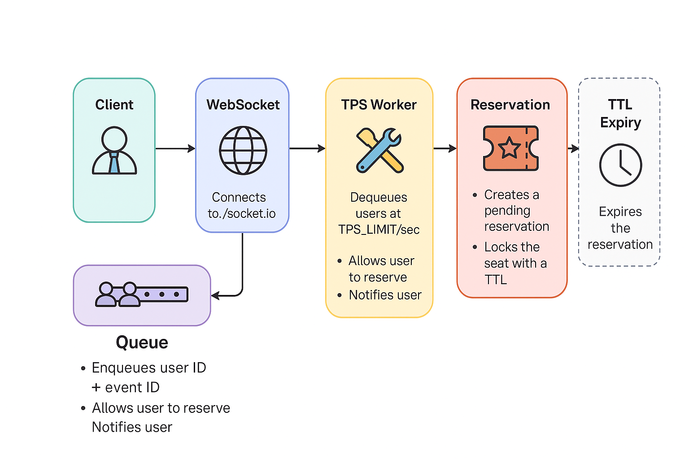

# 🏷️ 티켓 예매 시스템



> 실시간 대규모 트래픽 속에서도 안정적인 **티켓 예매 시스템**을 직접 설계하고 구현한 프로젝트입니다. Kafka, Redis, NestJS 기반의 **이벤트 스트리밍 / 대기열 / 분산 트랜잭션** 등의 복합 기술을 다루며, Artillery를 사용해 실제와 유사한 조건에서의 **성능 테스트**까지 마쳤습니다.

## 개요

> **목표**: 실시간 대규모 트래픽 처리가 가능한 환경과 안정적인 티켓 예매 시스템을 구현하고, 성능 병목 요소를 직접 설계하고 테스트 한다.

> **활용 기술**: NestJS, Kafka, Redis, Docker, MySQL

👉 상세 설명: [티켓팅 시스템 개요](https://sihanni.tistory.com/167)

---

## 💬 1. 시스템 설계

### 아키텍처 구성

```
[User]
   │
 ┌▼──────────────┐
 │ React Client  │
 └▲────┬─────────┘
       │ WebSocket
  ┌────┴──────────────┐
  │ WebSocket Service │ ◀─ Redis ZSET 기반 대기열 처리
  └────┬──────────────┘
       │ Kafka (Active 입장 대상)
 ┌─────▼────────┐           Kafka          ┌──────────────┐
 │ Reservation  │ ───────────────────────▶ │ Payment      │
 │ Service      │ ◀─────────────────────── │ Service      │
 └─────┬────────┘         reservation.*    └──────────────┘
       │                                        │
   MySQL (예약)                             MySQL (결제)
       │                                        │
       │                                        │
       ▼                                        ▼
┌──────────────────────────┐        ┌──────────────────────────┐
│ KafkaRetryService        │        │ KafkaRetryService        │
│ (retryOrDlq 호출)         │        │ (retryOrDlq 호출)         │ 
└────────────┬─────────────┘        └────────────┬─────────────┘
             │                                     │
             ▼                                     ▼
  retry.reservation.paid.(n)           retry.reservation.requested.(n)
             │                                     │
             └────────────┬──────────────┬────────┘
                          ▼              ▼
                ┌─────────────────────────────┐
                │ RetryConsumerController     │  Kafka Consumer
                │ - 원래 토픽 추출               │
                │ - delay 계산                 │
                └────────────┬────────────────┘
                             ▼
                    Redis ZSET (지연 큐)
                             │
                             ▼
                ┌────────────────────────────┐
                │ RetryWorker (1초 주기 Poll)  │
                │ - zrangebyscore            │
                │ - Kafka 재전송               │
                └────────────┬───────────────┘
                             ▼
                      Kafka originalTopic
              (reservation.requested / paid)


```

- **Backend (Monorepo)**:
  - NestJS 기반 MSA 아키텍처로 설계됨
  - 서비스마다 독립된 역할, 컨트롤러/서비스/DB 구조, Kafka 메시지로 비동기 통신
  - 단, 실제로는 이 모든 서비스가 하나의 Git 저장소(monorepo) 안에 존재함서비스를 나눔
  - `user-service`: 회원 가입 / 로그인
  - `event-service`: 공연,이벤트 등록 / 조회
  - `seat-service`: 공연장 등록 / 공연장 별 좌석 생성 / 상세 조회
  - `reservation-service`: 티켓 예약, 만료 처리 등 핵심 서비스
  - `payment-service`: 결제 서버
  - `websocket-service`: 대기열 서버
- **Infra 구성 요소**:
  - **Redis**: 대기열 관리 및 세션 관리, lua-scripts를 활용한 좌석 선점 락 처리, 예약 상태 관리 등
  - **Kafka**: 예약 이벤트 비동기 처리, 서버간 메시지 브로커
  - **MySQL**: 정형화된 데이터 저장 (RDS)

## 🚦 2. 대기열 시스템

> 실시간 대기열 시스템은 \*\*가장 많은 시간과 고민을 했던 부분입니다.

- Redis `ZSET`을 활용해 유저의 순번을 관리
- WebSocket 접속 시 큐 등록 → 순번 실시간 전송
- TPS Worker가 Redis 기준으로 입장 대상 추출
- 입장 허용 시 `reservation-service`만 접근 허용
- TTL 만료 시 자리 반환 및 다음 유저 입장 처리

📌 TPS 제어 / 동시성 관리 / 메시지 발행 흐름까지 모두 포함된 **대기열 구조**

## 🔁 3. Kafka 재처리 전략 (Delay Queue, DLQ 기반)

> 실시간 대기열 시스템의 설계 경험을 그대로 확장 적용하여,  
> Kafka 메시지 처리 실패에 대한 **지연 재시도 로직**을 구현했습니다.

### 📦 전략 개요

- Kafka 메시지 처리 실패 시, 즉시 재처리하지 않고 **지연 큐에 등록**
- 각 원본 메시지 흐름에 대해 **분리된 retry topic** 설계
- Redis `ZSET`을 활용하여 **정밀한 delay timing 제어**
- 일정 시간이 지난 후, **원래 토픽으로 안전하게 재전송**
- 최대 재시도 횟수 초과 시 **DLQ(Dead Letter Queue)**로 전송

---

## 🧪 테스트 시나리오 및 결과

### 1. Artillery를 통한 부하 테스트

- 1000석의 공연장에 1~2분 간 최대 5000, 10000명 이상 동시 접속 테스트
- TPS 제한: 로컬 서버 스펙에 맞추어 초당 최대 200명 입장 허용 
- TTL 만료 시 좌석 회수 및 재입장 처리 정상 동작

### 2. Kafka 메시지 흐름 테스트

- 예약 요청 시 `reservation.requested` 메시지 발행
- `payment-service`에서 처리 후 `reservation.paid` 발행
- `reservation-service`에서 최종 Confirmed 처리

---

## ✅ 성과

- ✅ Kafka 기반 MSA 구성 및 메시지 흐름 설계
- ✅ Redis TTL / ZSET / 분산락 기능 활용
- ✅ TPS 기반 입장 제어 및 실시간 대기열 UI 연동
- ✅ 로컬 서버에서 5만 명 유저 / 1000석 공연 동시 예약 기준 부하 테스트
- ✅ Artillery TPS 측정, RPS 분석, 병목 구간 추적
- ✅ NestJS 기반 각 서비스 모듈 분리 및 Swagger 문서화
- ✅ pnpm workspace + Docker + .env 구성

---

## ✨기술 블로그 정리 글

☁️ DB 설계: [티켓팅 시스템 DB 설계](https://sihanni.tistory.com/168)

🌨️ 백엔드 설계 및 작업: [티켓팅 시스템 DB 설계](https://sihanni.tistory.com/168)

🌦️ 테스트 : [테스트 1](https://sihanni.tistory.com/177)

⛈️ 대기열 도입 : [대기열](https://sihanni.tistory.com/179)

🌪️ 통합 테스트 1 : [통합 테스트1](https://sihanni.tistory.com/180)

🌈 개선 작업과 최종 테스트 : [통합 테스트 및 개선](https://sihanni.tistory.com/181)

---
